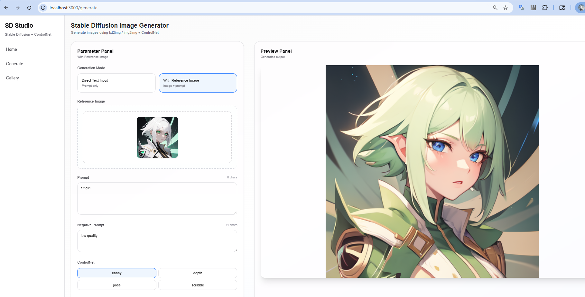
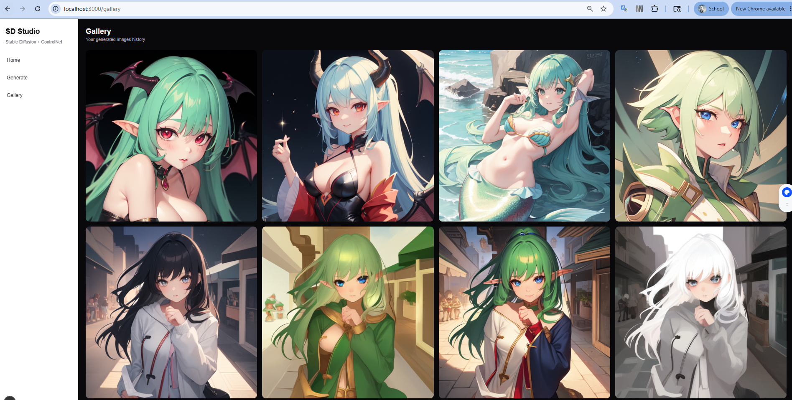

# SD ControlNet Studio

A lightweight AI image generation platform powered by Stable Diffusion + ControlNet.

---

## 📌 Overview

SD ControlNet Studio is a full-stack system for generating images using Stable Diffusion with optional ControlNet conditioning.

It provides a simple workflow:

- Submit prompt from web UI  
- Backend queues generation task  
- Worker runs diffusion inference  
- Generated images are stored and displayed in gallery  

---

## 🏗️ Architecture

Frontend (React)
↓
FastAPI Backend
↓
Redis Queue
↓
Worker (Diffusers + PyTorch)
↓
Generated Images + Metadata (MongoDB / Storage)

---

## 🧰 Tech Stack

### Backend
- FastAPI
- MongoDB (Motor async)
- Redis

### Worker
- PyTorch
- Diffusers
- Transformers
- OpenCV (optional)

### Frontend
- React
- TailwindCSS

---

## 🖼️ Demo

### 🏠 Home / Generation UI

---

### 🎛️ Control Panel

---

### 🖼️ Gallery View

---

## 🚀 Notes

- Worker must run on GPU-enabled machine
- Use `opencv-python-headless` in Docker
- Ensure Redis + MongoDB are running before backend start
